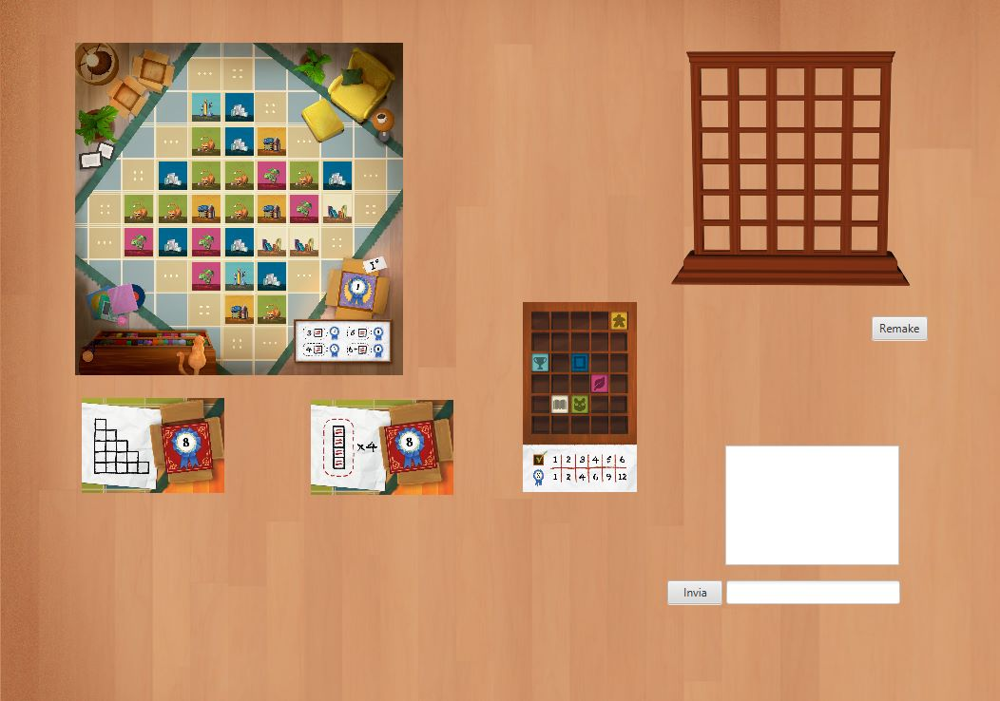

# Prova Finale di Ingegneria del Software - a.a. 2022-2023

**Gruppo AM37** 

Scopo del progetto è quello di implementare il gioco da tavola [MyShelfie](https://www.craniocreations.it/prodotto/my-shelfie), seguendo il pattern architetturale Model View Controller.
Il risultato finale copre completamente le regole definite dal gioco e permette di interagirci sia con una interfaccia da linea di comando (CLI) che grafica (GUI), la rete è stata gestita sia con il tradizionale approccio delle socket che con una tecnologia specifica di Java (RMI). 

# Documentazione

### UML 

I seguenti diagrammi delle classi rappresentano rispettivamente gli UML di alto livello e di dettagli del server e dei client, e l'UML del protocollo di comunicazione: 

- [UML alto livello](URL del link)
- [UML dettaglio](URL del link)
- [UML protocollo](URL del link)

### JavaDoc  

La seguente documentazione include una descrizione delle classi e dei metodi utilizzati, seguendo le tecniche di documentazione di Java. 

- [JavaDocs](URL del link)

### Librerie e plugins 

| Libreria/Plugin| Descrizione |
| :--------------| :------    |
| Maven          |    strumento di gestione per software basati su Java e build automation      | 
| junit          |      framework dedicato a Java per unit testing    | 
| gson           |    libreria per il supporto al parsing di file in formato json | 
| JavaFx         |     libreria grafica di Java |

### Jars 

I seguenti jar permettono il lancio del gioco secondo le funzionalità descritte nell'introduzione. Le funzionalità realizzate secondo la specifica del progetto sono elencate sotto. La cartella in cui si trovano il software del client e del server si trova al seguente indirizzo:  

- [Jars](URL del link)

# Esecuzione dei Jars

### Client   

Il client viene eseguito scegliendo l'interfaccia con cui giocare, le possibili scelte sono da linea di comando o interfaccia grafica. Le seguenti sezioni descrivono come eseguire il client in un modo o nell'altro. 

**CLI** 
Per lanciare il client in modalità CLI digitare il seguente comando: 

      java -jar AM37.jar cli
 

**GUI** 
Per poter lanciare il client con l'interfaccia grafica è necessario importare le dipendenze di JavaFx. 
A questo punto digitare il seguente comando che importa le dipendenze e lancia il client:

      java -jar AM37.jar gui

### Server 

L'esecuzione del server avviene attraverso il seguente comando:

      hhhh  

# Funzionalità

### Funzionalità sviluppate 

- Regole Complete  
- TUI  
- GUI  
- RMI  
- Socket  
- 1 FA 

### Funzionalità avanzate 

| Funzionalità                   |          |
| :----------------------------- | :------: |
| Patite multiple                |   ✅     | 
| Persistenza                    |   ❌     | 
| Resilienza alle disconnessioni |   ❌     | 
| Chat                           |    ❌    |

## Componenti del gruppo

- Bartocci Alessandra
- Bernasconi Margherita 
- Cicero Ramiro
- Cozzolino Nicola
